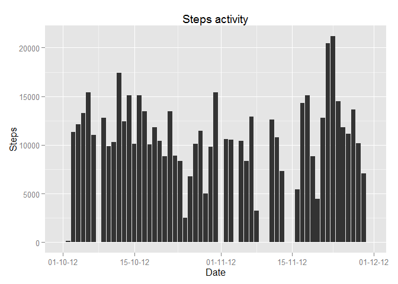
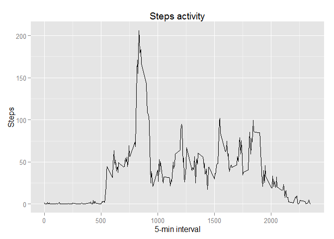
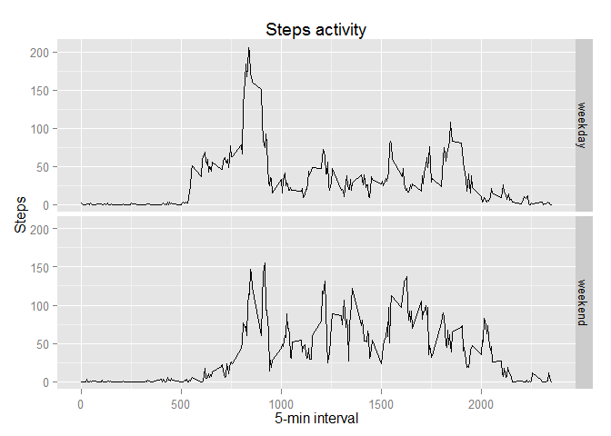

# Reproducible Research: Peer Assessment 1
Alexey Boev  
Sunday, November 16, 2014  

Loading and preprocessing the data
------------


```r
require(dplyr)
```

```
## Loading required package: dplyr
## 
## Attaching package: 'dplyr'
## 
## The following objects are masked from 'package:stats':
## 
##     filter, lag
## 
## The following objects are masked from 'package:base':
## 
##     intersect, setdiff, setequal, union
```

```r
require(ggplot2)
```

```
## Loading required package: ggplot2
```

```r
require(lubridate)
```

```
## Loading required package: lubridate
```

```r
require(scales)
```

```
## Loading required package: scales
```

```r
unzip("activity.zip")
activity <- tbl_df(read.csv2("activity.csv",
                          header=T,
                          sep = ",",
                          stringsAsFactors = F)) %>%
        mutate(date= ymd(date))
```
What is mean total number of steps taken per day?
------------

```r
StepsPerDay <- activity %>% 
        group_by(date) %>%
        summarise(steps= sum(steps,na.rm=T))
```
1. Make a histogram of the total number of steps taken each day  


```r
ggplot(data=StepsPerDay, aes(x=as.Date(date), y=steps))+
        geom_bar(stat="identity")+
        scale_x_date(labels= date_format("%d-%m-%y"))+
        labs(title = "Steps activity")+
        labs(x= "Date", y= "Steps")
```

 

2. Calculate and report the mean and median total number of steps taken per day

```r
activity %>%
        filter(!is.na(steps)) %>%
        group_by(date) %>%
        summarise(steps= sum(steps)) %>%
        summarise(median= median(steps),mean= mean(steps))
```

```
## Source: local data frame [1 x 2]
## 
##   median     mean
## 1  10765 10766.19
```

What is the average daily activity pattern?
------------
1. Make a time series plot (i.e. type = "l") of the 5-minute interval (x-axis) and the average number of steps taken, averaged across all days (y-axis)  


```r
StepsPerInterval <- activity %>%
        filter(!is.na(steps)) %>%
        group_by(interval)  %>%
        summarise(steps= mean(steps))

ggplot(data=StepsPerInterval, aes(x=interval, y=steps))+
        geom_line()+
        labs(title = "Steps activity")+
        labs(x= "5-min interval", y= "Steps")
```

 

2. Which 5-minute interval, on average across all the days in the dataset, contains the maximum number of steps?  


```r
StepsPerInterval[StepsPerInterval$steps==max(StepsPerInterval$steps),"interval"]
```

```
## [1] 835
```

Imputing missing values
------------

1. Calculate and report the total number of missing values in the dataset (i.e. the total number of rows with NAs)  


```r
nrow(filter(activity,is.na(steps)))
```

```
## [1] 2304
```

`2. Devise a strategy for filling in all of the missing values in the dataset. The strategy does not need to be sophisticated. For example, you could use the mean/median for that day, or the mean for that 5-minute interval, etc.

I used the means for the 5-minute intervals as fillers for missing values

2. Create a new dataset that is equal to the original dataset but with the missing data filled in.


```r
addData <- activity %>%
        group_by(interval)  %>%
        summarise(stepsNA= median(steps,na.rm=T))
activityNA <- left_join(activity,addData) %>%
        mutate(steps= ifelse(is.na(steps),stepsNA,steps))
```

```
## Joining by: "interval"
```
3. Make a histogram of the total number of steps taken each day and Calculate and report the mean and median total number of steps taken per day. Do these values differ from the estimates from the first part of the assignment? What is the impact of imputing missing data on the estimates of the total daily number of steps?


```r
ggplot(data=activityNA, aes(x=as.Date(date), y=steps))+
        geom_bar(stat="identity")+
        scale_x_date(labels= date_format("%d-%m-%y"))+
        labs(title = "Steps activity")+
        labs(x= "Date", y= "Steps")
```

 

```r
activityNA %>%
        group_by(date) %>%
        summarise(steps= sum(steps)) %>%
        summarise(median= median(steps),mean= mean(steps))
```

```
## Source: local data frame [1 x 2]
## 
##   median     mean
## 1  10395 9503.869
```

New values of mean and median are much lower than values without NA.

Are there differences in activity patterns between weekdays and weekends?
------------

1. Create a new factor variable in the dataset with two levels -- "weekday" and "weekend" indicating whether a given date is a weekday or weekend day.


```r
wdData <- activityNA %>% 
        mutate(isweekend= ifelse(wday(date)== 1|wday(date)==7,
                                 "weekend","weekday")
                                 ) %>%
        group_by(isweekend,interval)  %>%
        summarise(steps= mean(steps))
```
2. Make a panel plot containing a time series plot (i.e. type = "l") of the 5-minute interval (x-axis) and the average number of steps taken, averaged across all weekday days or weekend days (y-axis).

```r
ggplot(data=wdData, aes(x=interval, y=steps))+
        geom_line()+
        facet_grid(isweekend ~ .)+
        labs(title = "Steps activity")+
        labs(x= "5-min interval", y= "Steps")
```

 


